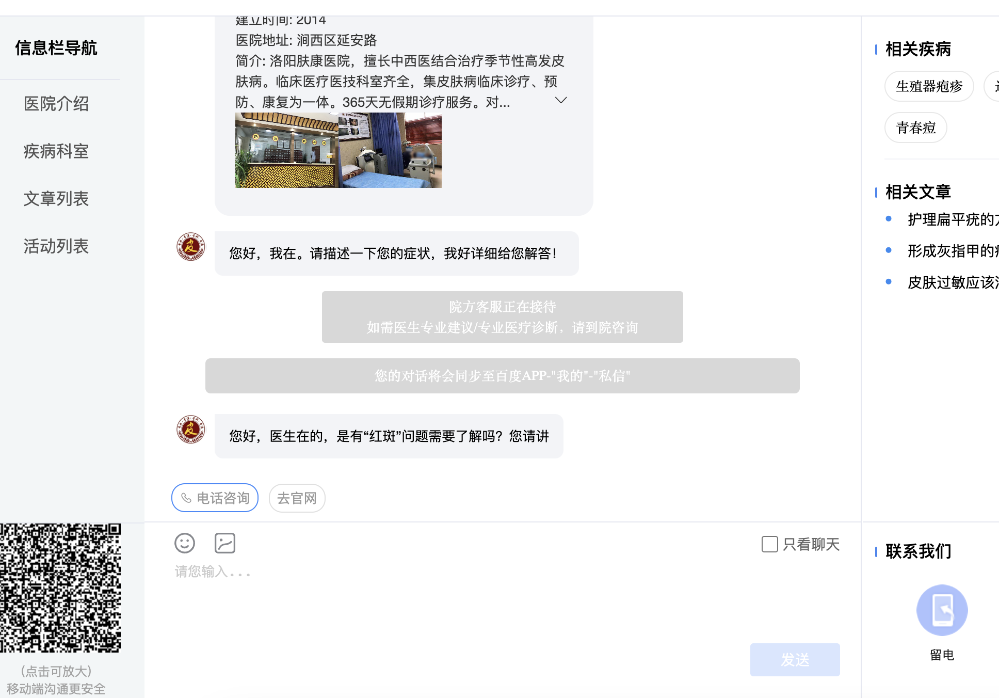

# contactPutianHospital

<div align="center">
    <a href="https://github.com/ehnait/contactPutianHospital/releases" target="_blank">
        </a>
    <a href="https://github.com/ehnait/contactPutianHospital/issues" target="_blank">
        </a>
    <a href="https://github.com/ehnait/contactPutianHospital/issues?q=is%3Aissue+is%3Aclosed" target="_blank">
        </a>
    <a href="https://shields.io/" target="_blank">
        </a>
</div>

## 说明

本项目通过在百度上爬取「莆田系医院」这一营销组件的企业的网址, 然后模拟浏览器将目标手机号发送给企业，让企业销售给目标联系人打电话。

- 此项目借鉴[callPhoneBoom](https://github.com/olyble/callPhoneBoom)
  ，使用[DrissionPage](http://g1879.gitee.io/drissionpagedocs/)简化浏览器操作流程并对边界情况进行了处理。
- 重写catch.py脚本，获取api更丝滑了，[api列表更新](api.txt)

## Feature

主动帮助坏蛋蛋联系 **莆田系医院** 并留下电话号码。此举深藏功与名，每联系一次都会使你 **功德+1**

1. **main.py**：通过程序模拟浏览莆田系医院网址，自动发送目标手机号给企业 。
2. **scheduler.py**:设置定时任务
3. **catch.py**:批量爬取莆田系医院网址

## 使用教程

1. 克隆或下载你的代码到本地。
2. 创建一个新的虚拟环境（可选）。
3. 在终端或命令提示符下进入项目目录，并激活虚拟环境（如果有）。
4. 运行以下命令来安装依赖项：
   ```
   pip install -r requirements.txt
   ```
5. 查看 **main.py**的注释， 确保配置正确 ，运行 **main.py**

## 常见问题

在提issue前，请务必拉取最新代码🙏🏻

1. 问:聊天内容是否能自定义？
    - 答:不能，那是网页本身控制的。
2. 问:有没有人用过？输入的手机号，实际会不会接收到电话轰炸？
    - 答:这个程序只是模拟了咨询网站输入并发送手机号的操作，然后批量处理。至于业务员会不会给你回电话，换成自己手机号去试试。
3. 问:怎么知道程序是正常运行的？
    - 答:代码就一个文件并且很简单，每一个地方都添加了详细注释。请稍微动下脑子debug一下就知道有没有正常运行。
4. 问：是否能在linux cmd模式下运行
    - 答: [👉 issues/23](https://github.com/ehnait/contactPutianHospital/issues/23)

## 更新记录

[👉看这里👈](https://github.com/ehnait/contactPutianHospital/releases)

## 运行截图



## 免责声明

1. 若使用者滥用本项目,本人 **无需承担** 任何法律责任.
2. 本程序仅供娱乐,源码全部开源,**禁止滥用** 和二次 **贩卖盈利**.  **禁止用于商业用途**.
